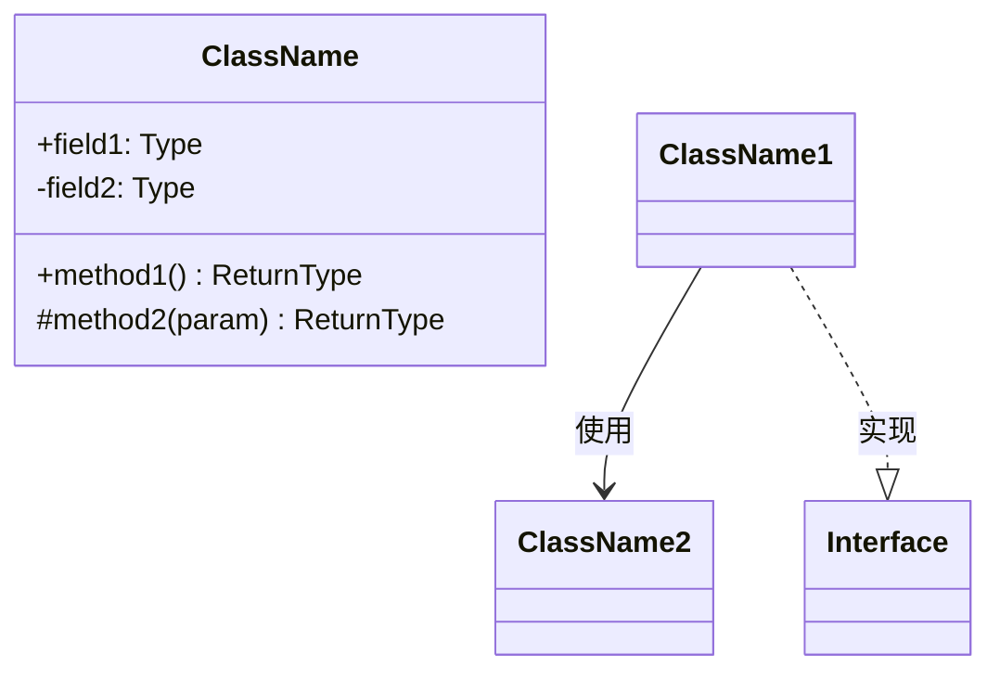
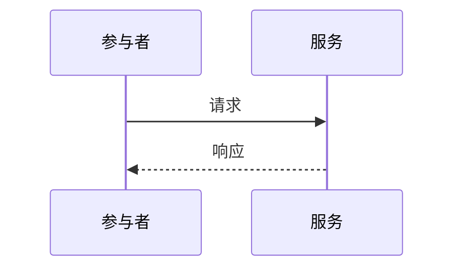
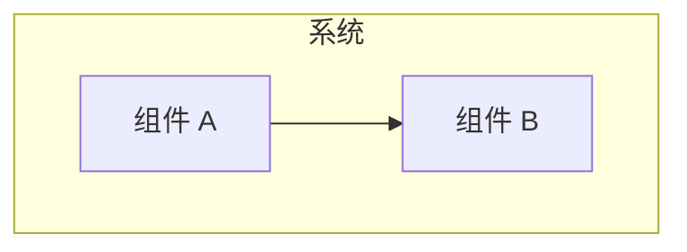
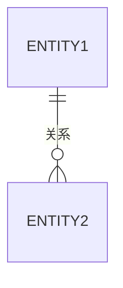

# UML 生成器技能

从代码分析生成 Mermaid 格式 UML 图的技能。

## 能力

- 类图
- 序列图
- 组件图
- 实体关系图
- 状态图
- 活动图

## 输出格式

所有图表均以 Mermaid 格式生成，便于嵌入 Markdown 文档。

## 图表类型

### 类图

从以下内容生成类图：
- TypeScript 接口和类
- Python 类和数据类
- Java 类和接口



### 序列图

从以下内容生成序列图：
- API 请求流程
- 服务交互
- 事件处理



### 组件图

从以下内容生成组件图：
- 模块结构
- 服务架构
- 系统边界



### ER 图

从以下内容生成 ER 图：
- 数据库模型
- ORM 实体
- Schema 定义



## 分析流程

### TypeScript/JavaScript

1. 解析类/接口定义
2. 提取属性和方法
3. 映射继承和实现
4. 识别关系

### Python

1. 解析类定义
2. 提取 @dataclass 字段
3. 映射继承
4. 识别组合

### Java

1. 解析类/接口文件
2. 提取字段和方法
3. 映射 extends/implements
4. 识别注解

## 用法

```bash
# 为 src/models 生成类图
/polyglot:docs uml --type=class --path=src/models

# 为认证流程生成序列图
/polyglot:docs uml --type=sequence --flow=auth

# 生成组件图
/polyglot:docs uml --type=component
```

## 输出位置

图表保存到 `docs/diagrams/` 并使用适当命名：
- `class-[范围].md`
- `sequence-[流程].md`
- `component.md`
- `er-diagram.md`
