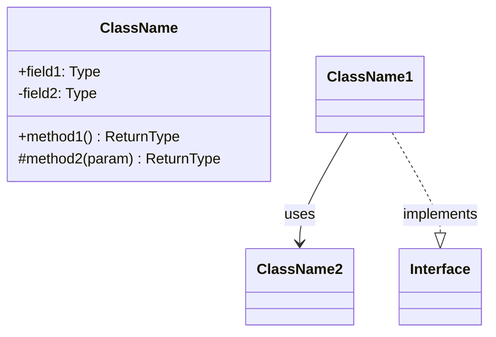
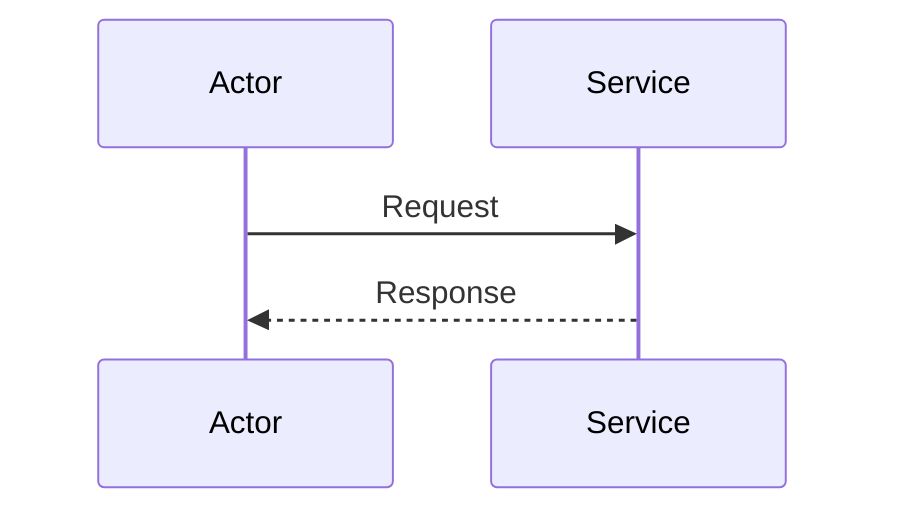
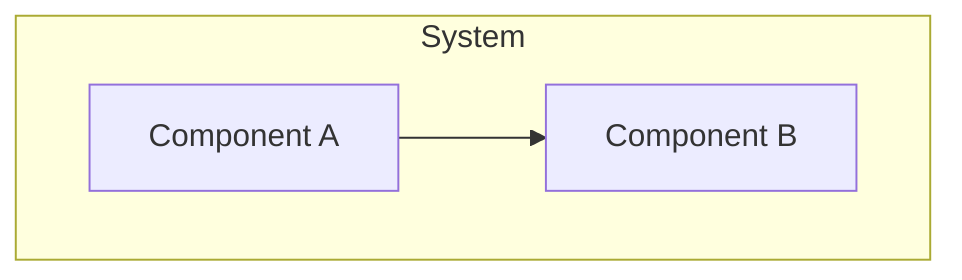
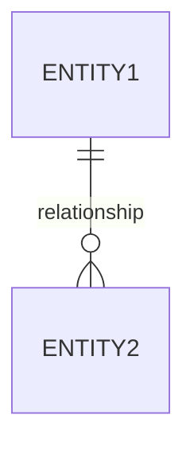

# UML Generator Skill

A skill for generating UML diagrams in Mermaid format from code analysis.

## Capabilities

- Class diagrams
- Sequence diagrams
- Component diagrams
- Entity-Relationship diagrams
- State diagrams
- Activity diagrams

## Output Format

All diagrams are generated in Mermaid format for easy embedding in Markdown documentation.

## Diagram Types

### Class Diagram

Generates class diagrams from:
- TypeScript interfaces and classes
- Python classes and dataclasses
- Java classes and interfaces



### Sequence Diagram

Generates sequence diagrams from:
- API request flows
- Service interactions
- Event processing



### Component Diagram

Generates component diagrams from:
- Module structure
- Service architecture
- System boundaries



### ER Diagram

Generates ER diagrams from:
- Database models
- ORM entities
- Schema definitions



## Analysis Process

### TypeScript/JavaScript

1. Parse class/interface definitions
2. Extract properties and methods
3. Map inheritance and implementation
4. Identify relationships

### Python

1. Parse class definitions
2. Extract @dataclass fields
3. Map inheritance
4. Identify composition

### Java

1. Parse class/interface files
2. Extract fields and methods
3. Map extends/implements
4. Identify annotations

## Usage

```bash
# Generate class diagram for src/models
/polyglot:docs uml --type=class --path=src/models

# Generate sequence diagram for auth flow
/polyglot:docs uml --type=sequence --flow=auth

# Generate component diagram
/polyglot:docs uml --type=component
```

## Output Location

Diagrams are saved to `docs/diagrams/` with appropriate naming:
- `class-[scope].md`
- `sequence-[flow].md`
- `component.md`
- `er-diagram.md`
