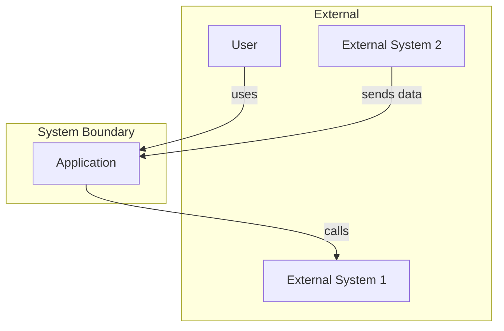
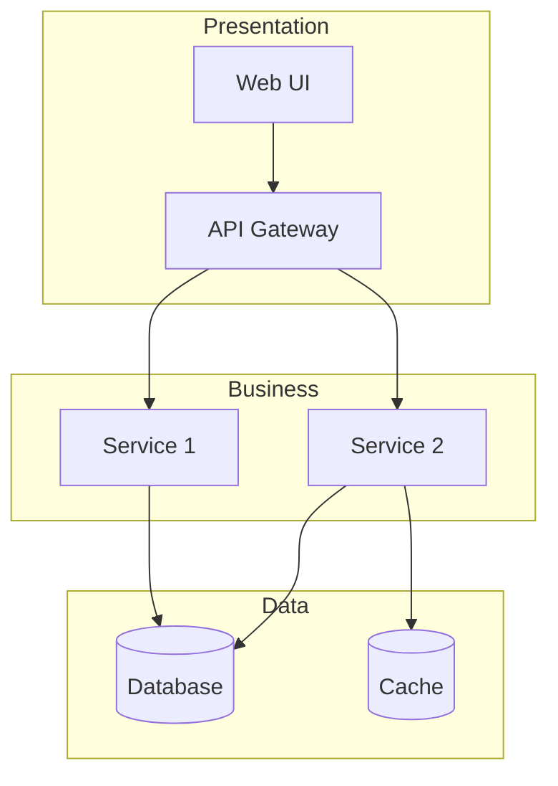
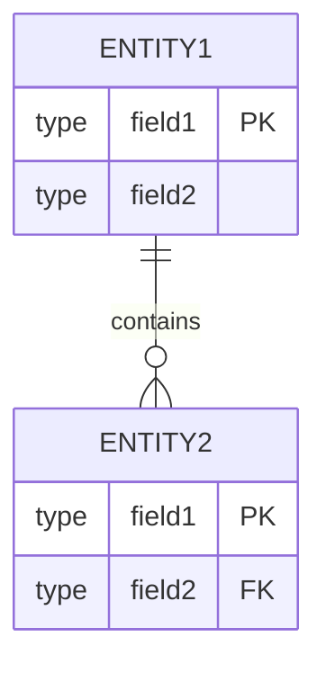
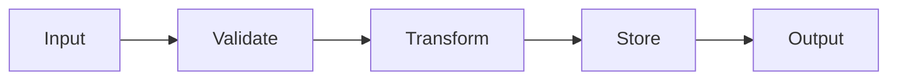
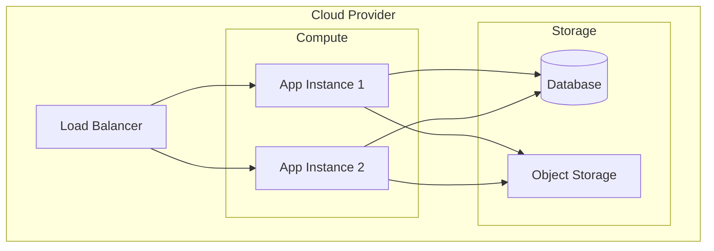

# [Project Name] Architecture Document

> **Version**: 1.0.0
> **Last Updated**: [Date]
> **Status**: [Draft/Review/Approved]

## Table of Contents

1. [Overview](#overview)
2. [System Context](#system-context)
3. [Architecture Decisions](#architecture-decisions)
4. [Components](#components)
5. [Data Architecture](#data-architecture)
6. [Integration](#integration)
7. [Security](#security)
8. [Deployment](#deployment)
9. [Appendix](#appendix)

---

## Overview

### Purpose

[Describe the system's purpose and primary functions]

### Scope

This document covers:
- [Scope item 1]
- [Scope item 2]

This document does NOT cover:
- [Out of scope item 1]
- [Out of scope item 2]

### Stakeholders

| Role | Name | Responsibilities |
|------|------|------------------|
| Product Owner | [Name] | [Responsibilities] |
| Tech Lead | [Name] | [Responsibilities] |
| Developer | [Name] | [Responsibilities] |

---

## System Context

### Context Diagram



### External Dependencies

| System | Purpose | Protocol | Owner |
|--------|---------|----------|-------|
| [System 1] | [Purpose] | [Protocol] | [Owner] |
| [System 2] | [Purpose] | [Protocol] | [Owner] |

---

## Architecture Decisions

### ADR-001: [Decision Title]

**Status**: [Proposed/Accepted/Deprecated/Superseded]

**Context**:
[What is the issue that we're seeing that is motivating this decision?]

**Decision**:
[What is the change that we're proposing?]

**Consequences**:
- Positive: [Positive consequence]
- Negative: [Negative consequence]
- Neutral: [Neutral consequence]

**Alternatives Considered**:
1. [Alternative 1]: [Why rejected]
2. [Alternative 2]: [Why rejected]

---

## Components

### High-Level Architecture



### Component Details

#### [Component Name]

| Attribute | Value |
|-----------|-------|
| **Purpose** | [What it does] |
| **Technology** | [Technologies used] |
| **Location** | [File/folder path] |
| **Dependencies** | [What it depends on] |
| **Dependents** | [What depends on it] |

**Responsibilities**:
- [Responsibility 1]
- [Responsibility 2]

**Interfaces**:
```typescript
interface ComponentInterface {
  // Interface definition
}
```

---

## Data Architecture

### Data Model



### Data Flow



### Data Storage

| Store | Type | Purpose | Retention |
|-------|------|---------|-----------|
| [Store 1] | [Type] | [Purpose] | [Retention] |
| [Store 2] | [Type] | [Purpose] | [Retention] |

---

## Integration

### API Contracts

| Endpoint | Method | Purpose |
|----------|--------|---------|
| `/api/v1/resource` | GET | [Purpose] |
| `/api/v1/resource` | POST | [Purpose] |

### Event Contracts

| Event | Publisher | Subscribers | Payload |
|-------|-----------|-------------|---------|
| [Event 1] | [Publisher] | [Subscribers] | [Schema] |

### Integration Patterns

- **Pattern 1**: [Description]
- **Pattern 2**: [Description]

---

## Security

### Authentication

[Describe authentication mechanism]

### Authorization

[Describe authorization model]

### Data Protection

| Data Type | Classification | Protection |
|-----------|---------------|------------|
| [Data 1] | [Classification] | [Protection] |

### Security Controls

- [ ] Input validation
- [ ] Output encoding
- [ ] Authentication required
- [ ] Authorization checked
- [ ] Encryption at rest
- [ ] Encryption in transit
- [ ] Audit logging

---

## Deployment

### Environment Overview

| Environment | Purpose | URL |
|-------------|---------|-----|
| Development | [Purpose] | [URL] |
| Staging | [Purpose] | [URL] |
| Production | [Purpose] | [URL] |

### Infrastructure



### Scaling Strategy

[Describe how the system scales]

---

## Appendix

### Glossary

| Term | Definition |
|------|------------|
| [Term 1] | [Definition] |
| [Term 2] | [Definition] |

### References

- [Reference 1](link)
- [Reference 2](link)

### Change Log

| Version | Date | Author | Changes |
|---------|------|--------|---------|
| 1.0.0 | [Date] | [Author] | Initial version |
