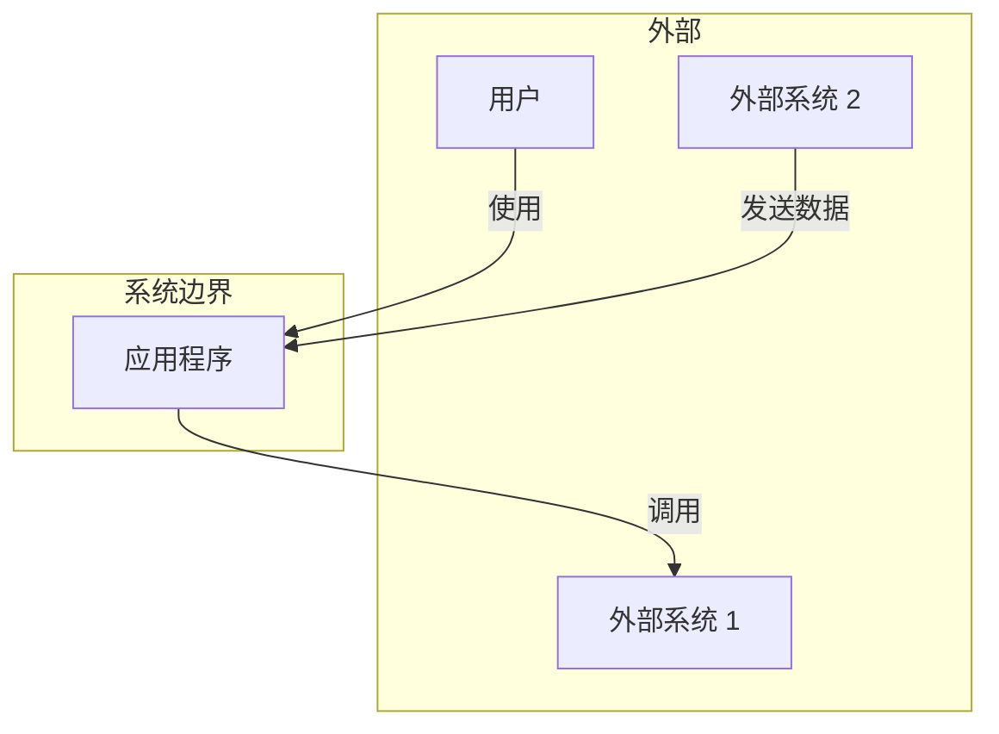
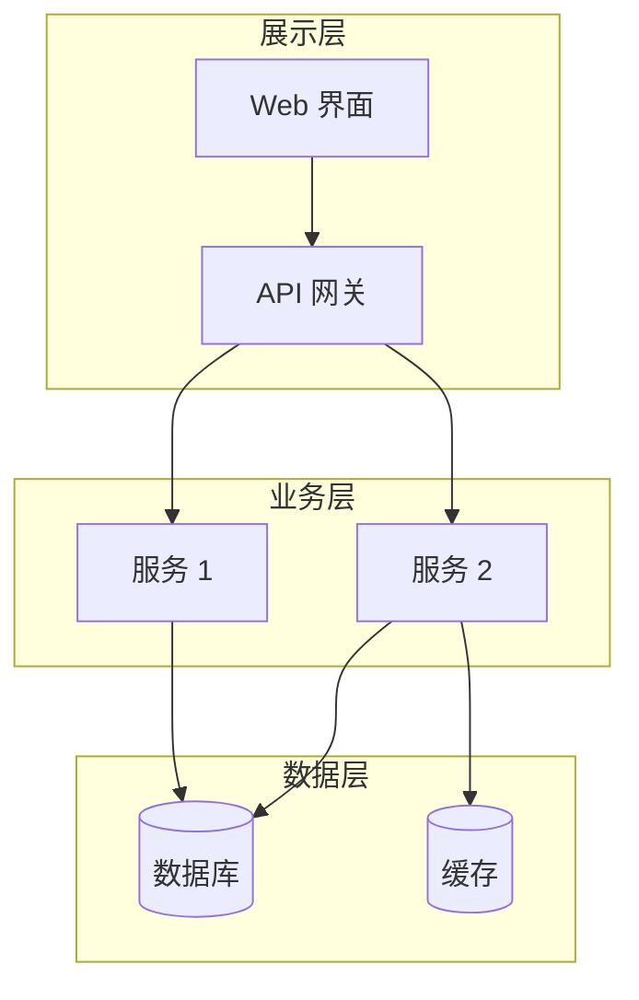
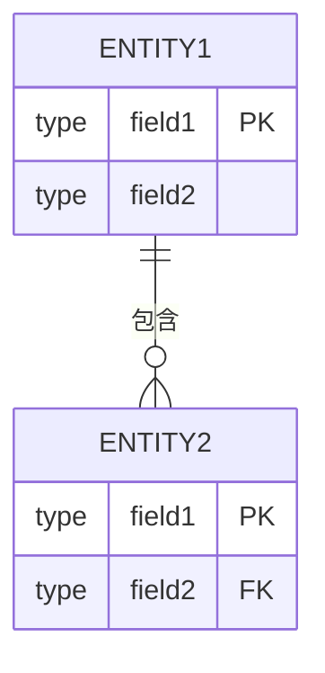
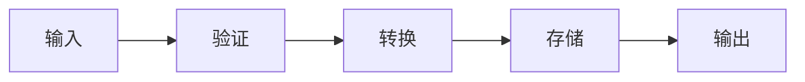
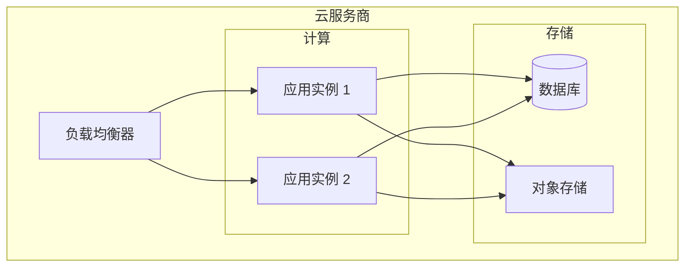

# [项目名称] 架构文档

> **版本**：1.0.0
> **最后更新**：[日期]
> **状态**：[草稿/审查中/已批准]

## 目录

1. [概述](#概述)
2. [系统上下文](#系统上下文)
3. [架构决策](#架构决策)
4. [组件](#组件)
5. [数据架构](#数据架构)
6. [集成](#集成)
7. [安全](#安全)
8. [部署](#部署)
9. [附录](#附录)

---

## 概述

### 目的

[描述系统的目的和主要功能]

### 范围

本文档涵盖：
- [范围项 1]
- [范围项 2]

本文档不涵盖：
- [范围外项 1]
- [范围外项 2]

### 利益相关者

| 角色 | 姓名 | 职责 |
|------|------|------|
| 产品负责人 | [姓名] | [职责] |
| 技术负责人 | [姓名] | [职责] |
| 开发人员 | [姓名] | [职责] |

---

## 系统上下文

### 上下文图



### 外部依赖

| 系统 | 用途 | 协议 | 负责人 |
|------|------|------|--------|
| [系统 1] | [用途] | [协议] | [负责人] |
| [系统 2] | [用途] | [协议] | [负责人] |

---

## 架构决策

### ADR-001：[决策标题]

**状态**：[提议/已接受/已弃用/已替代]

**背景**：
[促成此决策的问题是什么？]

**决策**：
[我们提议的变更是什么？]

**后果**：
- 正面：[正面影响]
- 负面：[负面影响]
- 中性：[中性影响]

**考虑的替代方案**：
1. [替代方案 1]：[为何放弃]
2. [替代方案 2]：[为何放弃]

---

## 组件

### 高层架构



### 组件详情

#### [组件名称]

| 属性 | 值 |
|------|------|
| **用途** | [它做什么] |
| **技术** | [使用的技术] |
| **位置** | [文件/文件夹路径] |
| **依赖** | [它依赖什么] |
| **被依赖** | [什么依赖它] |

**职责**：
- [职责 1]
- [职责 2]

**接口**：
```typescript
interface ComponentInterface {
  // 接口定义
}
```

---

## 数据架构

### 数据模型



### 数据流



### 数据存储

| 存储 | 类型 | 用途 | 保留期 |
|------|------|------|--------|
| [存储 1] | [类型] | [用途] | [保留期] |
| [存储 2] | [类型] | [用途] | [保留期] |

---

## 集成

### API 契约

| 端点 | 方法 | 用途 |
|------|------|------|
| `/api/v1/resource` | GET | [用途] |
| `/api/v1/resource` | POST | [用途] |

### 事件契约

| 事件 | 发布者 | 订阅者 | 负载 |
|------|--------|--------|------|
| [事件 1] | [发布者] | [订阅者] | [Schema] |

### 集成模式

- **模式 1**：[描述]
- **模式 2**：[描述]

---

## 安全

### 认证

[描述认证机制]

### 授权

[描述授权模型]

### 数据保护

| 数据类型 | 分类 | 保护措施 |
|----------|------|----------|
| [数据 1] | [分类] | [保护措施] |

### 安全控制

- [ ] 输入验证
- [ ] 输出编码
- [ ] 需要认证
- [ ] 授权检查
- [ ] 静态加密
- [ ] 传输加密
- [ ] 审计日志

---

## 部署

### 环境概述

| 环境 | 用途 | URL |
|------|------|-----|
| 开发 | [用途] | [URL] |
| 预发布 | [用途] | [URL] |
| 生产 | [用途] | [URL] |

### 基础设施



### 扩展策略

[描述系统如何扩展]

---

## 附录

### 术语表

| 术语 | 定义 |
|------|------|
| [术语 1] | [定义] |
| [术语 2] | [定义] |

### 参考资料

- [参考资料 1](链接)
- [参考资料 2](链接)

### 变更日志

| 版本 | 日期 | 作者 | 变更 |
|------|------|------|------|
| 1.0.0 | [日期] | [作者] | 初始版本 |
