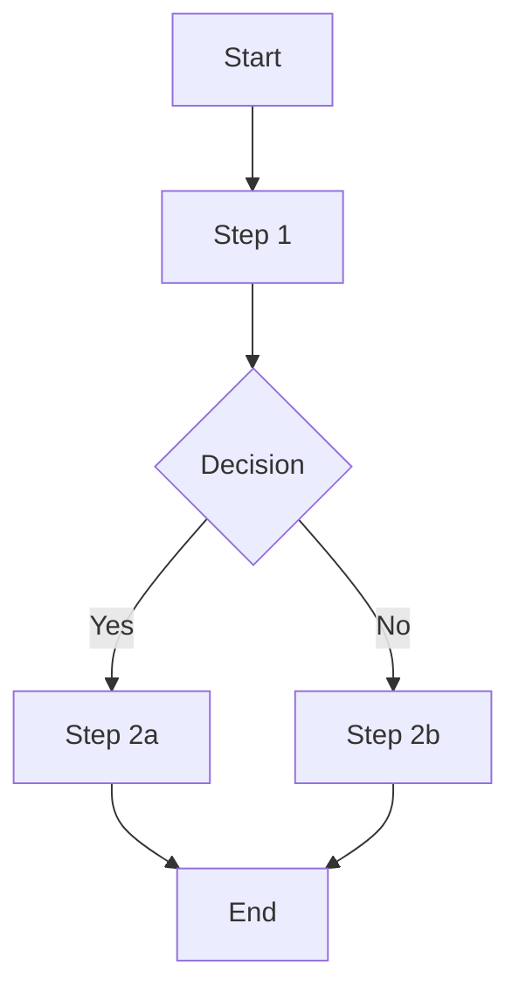

# Product Requirements Document (PRD)

> **Document Version**: 1.0
> **Status**: [Draft/Review/Approved]
> **Author**: [Author Name]
> **Date**: [Date]

---

## Overview

### Problem Statement

[Describe the problem being solved. What pain points exist? Why is this important?]

### Solution Summary

[High-level description of the proposed solution]

### Goals

| Goal | Success Metric | Target |
|------|----------------|--------|
| [Goal 1] | [Metric] | [Target value] |
| [Goal 2] | [Metric] | [Target value] |

### Non-Goals

- [What this project will NOT address]
- [Explicit out-of-scope items]

---

## Background

### Context

[Relevant background information, market context, user research findings]

### Current State

[How things work today, existing solutions, pain points]

### User Research

[Summary of user research, interviews, surveys that informed this PRD]

---

## Requirements

### User Stories

#### Epic 1: [Epic Name]

**US-001: [User Story Title]**
> As a [user type], I want to [action], so that [benefit].

**Acceptance Criteria**:
- [ ] [Criterion 1]
- [ ] [Criterion 2]
- [ ] [Criterion 3]

**Priority**: [High/Medium/Low]

---

**US-002: [User Story Title]**
> As a [user type], I want to [action], so that [benefit].

**Acceptance Criteria**:
- [ ] [Criterion 1]
- [ ] [Criterion 2]

**Priority**: [High/Medium/Low]

---

### Functional Requirements

| ID | Requirement | Priority | Notes |
|----|-------------|----------|-------|
| FR-001 | [Description] | Must Have | [Notes] |
| FR-002 | [Description] | Should Have | [Notes] |
| FR-003 | [Description] | Nice to Have | [Notes] |

### Non-Functional Requirements

| ID | Category | Requirement | Target |
|----|----------|-------------|--------|
| NFR-001 | Performance | [Requirement] | [Target] |
| NFR-002 | Security | [Requirement] | [Target] |
| NFR-003 | Scalability | [Requirement] | [Target] |
| NFR-004 | Availability | [Requirement] | [Target] |

---

## User Experience

### User Flows

#### Flow 1: [Flow Name]

**Description**: [Describe the flow]

### Wireframes

[Link to wireframes or embed images]

### UI/UX Considerations

- [Consideration 1]
- [Consideration 2]

---

## Technical Considerations

### Architecture Overview

[High-level technical approach]

### Dependencies

| Dependency | Type | Description | Risk |
|------------|------|-------------|------|
| [Dep 1] | Internal/External | [Description] | [Risk] |

### Integration Points

| System | Integration Type | Purpose |
|--------|-----------------|---------|
| [System 1] | API/Event/etc | [Purpose] |

### Technical Constraints

- [Constraint 1]
- [Constraint 2]

### Security Requirements

- [ ] [Security requirement 1]
- [ ] [Security requirement 2]

---

## Implementation Plan

### Phases

#### Phase 1: [Phase Name] - [Timeframe]

| Task | Owner | Dependencies |
|------|-------|--------------|
| [Task 1] | [Owner] | [Dependencies] |
| [Task 2] | [Owner] | [Dependencies] |

**Deliverables**: [List of deliverables]

#### Phase 2: [Phase Name] - [Timeframe]

[Repeat structure]

### Milestones

| Milestone | Date | Success Criteria |
|-----------|------|------------------|
| [Milestone 1] | [Date] | [Criteria] |
| [Milestone 2] | [Date] | [Criteria] |

---

## Risks and Mitigations

| Risk | Likelihood | Impact | Mitigation |
|------|------------|--------|------------|
| [Risk 1] | High/Med/Low | High/Med/Low | [Mitigation strategy] |
| [Risk 2] | High/Med/Low | High/Med/Low | [Mitigation strategy] |

---

## Success Metrics

### Key Performance Indicators (KPIs)

| KPI | Current | Target | Measurement |
|-----|---------|--------|-------------|
| [KPI 1] | [Current] | [Target] | [How measured] |
| [KPI 2] | [Current] | [Target] | [How measured] |

### Launch Criteria

- [ ] [Criterion 1]
- [ ] [Criterion 2]
- [ ] [Criterion 3]

---

## Open Questions

| Question | Status | Owner | Decision |
|----------|--------|-------|----------|
| [Question 1] | Open/Resolved | [Owner] | [Decision if resolved] |
| [Question 2] | Open/Resolved | [Owner] | [Decision if resolved] |

---

## Appendix

### Glossary

| Term | Definition |
|------|------------|
| [Term 1] | [Definition] |
| [Term 2] | [Definition] |

### References

- [Reference 1](link)
- [Reference 2](link)

### Revision History

| Version | Date | Author | Changes |
|---------|------|--------|---------|
| 1.0 | [Date] | [Author] | Initial version |
