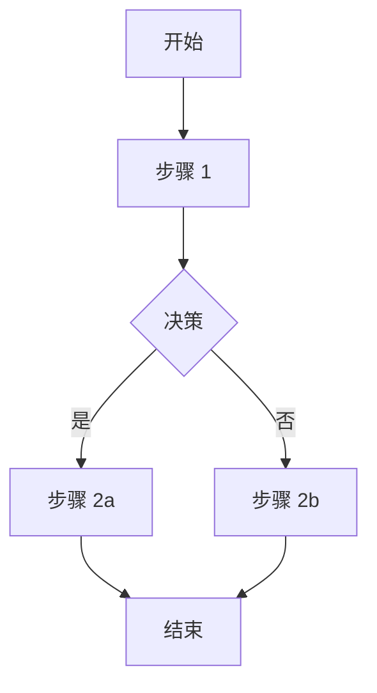

# 产品需求文档（PRD）

> **文档版本**：1.0
> **状态**：[草稿/审查中/已批准]
> **作者**：[作者姓名]
> **日期**：[日期]

---

## 概述

### 问题陈述

[描述正在解决的问题。存在哪些痛点？为什么这很重要？]

### 解决方案概述

[提议解决方案的高层描述]

### 目标

| 目标 | 成功指标 | 目标值 |
|------|----------|--------|
| [目标 1] | [指标] | [目标值] |
| [目标 2] | [指标] | [目标值] |

### 非目标

- [本项目不会解决的内容]
- [明确排除在范围外的项目]

---

## 背景

### 上下文

[相关背景信息、市场环境、用户研究发现]

### 现状

[当前的工作方式、现有解决方案、痛点]

### 用户研究

[为本 PRD 提供信息的用户研究、访谈、调查摘要]

---

## 需求

### 用户故事

#### 史诗 1：[史诗名称]

**US-001：[用户故事标题]**
> 作为一个 [用户类型]，我想要 [动作]，以便 [收益]。

**验收标准**：
- [ ] [标准 1]
- [ ] [标准 2]
- [ ] [标准 3]

**优先级**：[高/中/低]

---

**US-002：[用户故事标题]**
> 作为一个 [用户类型]，我想要 [动作]，以便 [收益]。

**验收标准**：
- [ ] [标准 1]
- [ ] [标准 2]

**优先级**：[高/中/低]

---

### 功能性需求

| ID | 需求 | 优先级 | 备注 |
|----|------|--------|------|
| FR-001 | [描述] | 必须有 | [备注] |
| FR-002 | [描述] | 应该有 | [备注] |
| FR-003 | [描述] | 可以有 | [备注] |

### 非功能性需求

| ID | 类别 | 需求 | 目标 |
|----|------|------|------|
| NFR-001 | 性能 | [需求] | [目标] |
| NFR-002 | 安全 | [需求] | [目标] |
| NFR-003 | 可扩展性 | [需求] | [目标] |
| NFR-004 | 可用性 | [需求] | [目标] |

---

## 用户体验

### 用户流程

#### 流程 1：[流程名称]

**描述**：[描述流程]

### 线框图

[链接到线框图或嵌入图片]

### UI/UX 考虑

- [考虑 1]
- [考虑 2]

---

## 技术考虑

### 架构概述

[高层技术方案]

### 依赖项

| 依赖 | 类型 | 描述 | 风险 |
|------|------|------|------|
| [依赖 1] | 内部/外部 | [描述] | [风险] |

### 集成点

| 系统 | 集成类型 | 用途 |
|------|----------|------|
| [系统 1] | API/事件等 | [用途] |

### 技术约束

- [约束 1]
- [约束 2]

### 安全需求

- [ ] [安全需求 1]
- [ ] [安全需求 2]

---

## 实施计划

### 阶段

#### 阶段 1：[阶段名称] - [时间范围]

| 任务 | 负责人 | 依赖 |
|------|--------|------|
| [任务 1] | [负责人] | [依赖] |
| [任务 2] | [负责人] | [依赖] |

**交付物**：[交付物列表]

#### 阶段 2：[阶段名称] - [时间范围]

[重复结构]

### 里程碑

| 里程碑 | 日期 | 成功标准 |
|--------|------|----------|
| [里程碑 1] | [日期] | [标准] |
| [里程碑 2] | [日期] | [标准] |

---

## 风险与缓解

| 风险 | 可能性 | 影响 | 缓解措施 |
|------|--------|------|----------|
| [风险 1] | 高/中/低 | 高/中/低 | [缓解策略] |
| [风险 2] | 高/中/低 | 高/中/低 | [缓解策略] |

---

## 成功指标

### 关键绩效指标（KPI）

| KPI | 当前值 | 目标值 | 测量方式 |
|-----|--------|--------|----------|
| [KPI 1] | [当前值] | [目标值] | [测量方式] |
| [KPI 2] | [当前值] | [目标值] | [测量方式] |

### 上线标准

- [ ] [标准 1]
- [ ] [标准 2]
- [ ] [标准 3]

---

## 待解决问题

| 问题 | 状态 | 负责人 | 决定 |
|------|------|--------|------|
| [问题 1] | 待解决/已解决 | [负责人] | [如已解决则填写决定] |
| [问题 2] | 待解决/已解决 | [负责人] | [如已解决则填写决定] |

---

## 附录

### 术语表

| 术语 | 定义 |
|------|------|
| [术语 1] | [定义] |
| [术语 2] | [定义] |

### 参考资料

- [参考资料 1](链接)
- [参考资料 2](链接)

### 修订历史

| 版本 | 日期 | 作者 | 变更 |
|------|------|------|------|
| 1.0 | [日期] | [作者] | 初始版本 |
